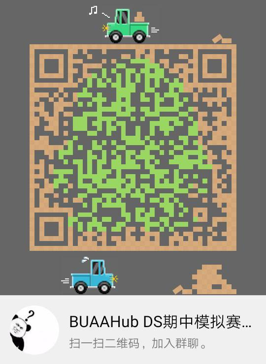

# BuaaHub - 数据结构期中模拟抽奖方案公示

BuaaHub - 数据结构期中模拟比赛阶段已经正式结束，下面进入抽奖环节。为了保证该环节的公开公平公正，特制定本方案，并向全体参赛者公布。

本次抽奖采用的基本方式为随机数法，为了确保随机性和可复现性，我们采用以下方式生成随机数：

* 用 python 的 random 库以一个时间点（目前确定为今晚（4 月 23 日）20:00:00）以后第一个 BTC 新块的哈希字符串作为种子，信息来源为 `https://www.blockchain.com/zh/explorer`
* 使用 `random.randint(6, N)` 取值，其中 `N` 代表参加本次比赛的总人数，被随机选中的参赛者应该对的以下要求：

  * 应当是北京航空航天大学的在校学生
  * 应当在本次模拟赛中有某一编程题的非 0 提交记录

  若不符合以上要求，我们将会作废这个号码，并将重新抽取数字。
* 本次抽取所使用的环境为 `Python 3.7.3 (default, Mar 26 2019, 21:43:19) [GCC 8.2.1 20181127] on linux`

生成随机数后，我们将按照排行榜上的排名与中奖数字一一对应，向中奖者发放奖励。中奖者有权利拒绝奖励，并可以选择将奖励物品出让。

本次抽奖成立了相应的 QQ 群，群号为 `794860630`，群二维码：  
  
欢迎大家进群对本次抽奖过程进行监督。

本次抽奖活动最终解释权归 BuaaHub 全体成员共有。

特此公示，欢迎监督！

BuaaHub 2019 年 4 月 23 日
